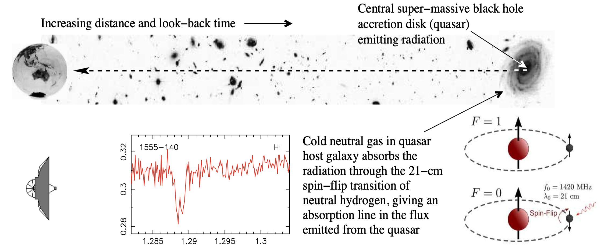

# Binary Classification Workbench

An interactive Streamlit workbench for exploring **binary classification across different domains** — from severely imbalanced fraud detection to published astronomy datasets.

The project generalises an earlier fraud-detection workflow into a reusable application for:

- loading built-in or user-supplied binary datasets;
- exploring class-specific predictor distributions;
- comparing classifiers and class-imbalance strategies;
- evaluating precision, recall, F1, ROC/AUC and confusion matrices;
- tuning the decision threshold rather than assuming a fixed 0.5 cutoff;
- inspecting feature importance; and
- applying a fitted model to **fresh, unlabelled data**.

**Live app:** [https://binary-classification-workbench.streamlit.app](https://binary-classification-workbench.streamlit.app)

---

## Built-in examples

### Business application

#### Fraud / money-laundering detection — rare-event classification

Fraud and money-laundering detection are classic **rare-event classification problems**: the cases of greatest interest form only a very small fraction of the total population, while false positives can create substantial operational workload.

The built-in case study uses a fully synthetic dataset of **25,000 accounts**, generated for this project rather than drawn from any real company or platform (see [DATA_DICTIONARY.md](DATA_DICTIONARY.md) for the full feature list and generation methodology). Only approximately **1.5% are positive/suspect cases**. A classifier that simply labels every observation as non-suspect would therefore achieve about **98.5% accuracy while detecting no suspect cases at all**. This provides a clear example of why raw accuracy can be highly misleading for imbalanced classification problems.

The workbench uses this dataset to explore how different classifiers and class-imbalance strategies affect the ability to identify the rare positive class. Rather than asking only "How accurate is the model?", it focuses on the more useful questions:

- What proportion of genuinely suspect cases are detected (*recall*)?
- Of the cases flagged as suspect, how many are actually positive (*precision*)?
- How well does the model balance those two objectives (*F1*)?
- How many cases would ultimately be sent for investigation (*alert rate*)?
- How does changing the decision threshold alter each of these quantities?

The alert rate is particularly important in a fraud/AML setting because model predictions ultimately translate into human or automated investigation workload. A model with excellent recall may have little operational value if it flags an unmanageable proportion of all accounts, while an excessively conservative threshold may produce very few alerts but fail to detect many genuine cases.

In the original workflow that led to this workbench, **XGBoost with class weighting** provided an operating point at a decision threshold of approximately **0.65**, giving around **20.0% precision, 25.3% recall, F1 ≈ 0.224 and an alert rate of approximately 1.90%**. These values are illustrative rather than fixed: the workbench allows the model, imbalance strategy, train/test split and random seed to be changed, making it possible to examine how robust an apparent operating point is. The modest precision and recall here are also, in themselves, an honest illustration of the problem: even a model with genuine, validated signal (this dataset was checked to have real learnable structure, not noise) struggles to separate a genuinely rare event cleanly — which is exactly why threshold selection and operational trade-offs matter more than chasing a single accuracy number.

### Astrophysical application

#### Absorption of background radiation by the star-forming gas in foreground galaxies

The next generation of large radio astronomy surveys, with the Square Kilometre Array and its pathfinders, are expected to discover such large numbers of galaxies, through their absorption of background radio emission, that classifying them all using traditional optical spectroscopy will become impractical.



I therefore pioneered using machine learning to classify whether the absorption:

  - is *associated* with the host galaxy of the background radio galaxy/quasar itself (above figure), or
  - arises from a galaxy *intervening* the sight line to the radio source.

Although current samples remain small, this approach has the potential to characterise active and quiescent galaxy populations that are difficult or impossible to identify optically, with implications for estimates of the baryonic (normal) matter content of the Universe.

**Sample 1: Curran (2021)**

An update of the initial study
([Curran, et al. (2016)](https://ui.adsabs.harvard.edu/abs/2016MNRAS.462.4197C/abstract)), the
[Curran (2021)](https://academic.oup.com/mnras/article/506/1/1548/6313314) sample contains 80 associated and 56 intervening absorbers.

The workbench uses *Associated* as the positive class, consistent with the paper's binary setup.

**Sample 2: Mondal et al. (2025)**

The sample of [Mondal et al. (2025)](https://academic.oup.com/mnras/article/544/4/3456/8315938) has 74 associated and 44 intervening absorbers and largely overlaps the above sample. However, rather than using the same derived spectral parameters, a 13-parameter Busy function is fit to each spectrum.

The workbench uses *Intervening* as the positive class, consistent with the paper's binary setup, and demonstrates that the user can choose their own spectral parameters.

> The astronomy datasets demonstrate cross-domain portability. The workbench uses its own configurable hold-out evaluation workflow and does **not** claim to reproduce the papers' published cross-validation protocols or reported metrics.

---

## Model Workbench

The application currently offers the ML classifiers:

- XGBoost
- Random Forest
- Logistic Regression
- Decision Tree

And class imbalance can be handled via:

- No adjustment
- Class weighting
- SMOTE
- Under-sampling

Imputation, scaling and any resampling are learned from the **training split only**. The held-out test set retains its original class distribution.

---

## Threshold optimisation

A classifier produces probabilities; the threshold determines when those probabilities become positive predictions.

Rather than automatically using 0.5, the workbench evaluates candidate thresholds from **0.01 to 0.99** and initialises the operating point at the threshold that maximises **F1**.

Users can then explore the trade-off between:

- precision;
- recall;
- F1;
- false positives and false negatives; and
- positive prediction / alert rate.

---

## Predict New Data

After fitting a model, the Predict New Data tab accepts an unlabelled CSV containing the required predictor columns. This:

1. validates the predictor schema;
2. applies the same fitted imputation and scaling pipeline used during training;
3. generates positive-class probabilities;
4. converts probabilities to binary predictions at an adjustable threshold; and
5. exports a scored CSV containing the original data plus:
   - `Predicted positive probability`
   - `Predicted class`

An empty input template containing the required feature columns can also be downloaded from the app.

---

## Running locally

```bash
python -m venv .venv
source .venv/bin/activate
pip install -r requirements.txt
streamlit run app/binary_classification_app.py
```

---

## Repository structure

```text
binary-classification-workbench/
├── .gitignore
├── LICENSE
├── README.md
├── DATA_DICTIONARY.md
├── requirements.txt
├── app/
│   └── binary_classification_app.py
├── data/
│   ├── synthetic_gambling_aml.csv
│   ├── generate_dataset.py
│   ├── thresholds.csv
│   ├── Curran_2021.csv
│   └── Mondal_2025.csv
└── src/
    └── __init__.py
```

---

## Data

The fraud/AML case study uses a fully synthetic dataset generated for this project — not derived from any real gambling platform, company dataset or interview assignment. See [DATA_DICTIONARY.md](DATA_DICTIONARY.md) for the full feature list and generation methodology. The astronomy datasets are drawn from published, peer-reviewed research (see citations above).

---

## Technologies

- Python
- Streamlit
- pandas / NumPy
- scikit-learn
- XGBoost
- imbalanced-learn
- SciPy
- Matplotlib

---

## Interpretation

This is an analytical and educational workbench rather than a production decision system. Model performance depends on feature quality, class prevalence, sampling, the data-generating process and the relative consequences of false-positive and false-negative decisions.
